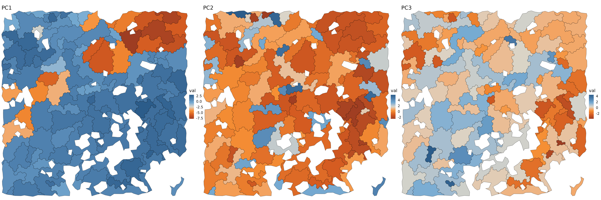
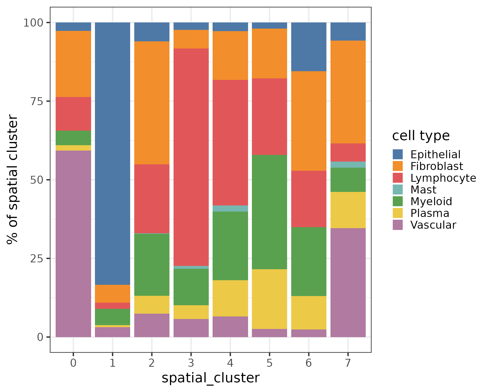

# Quickstart: Using Tessera on a Single Sample

## Libs

``` r
suppressPackageStartupMessages({
    library(tessera)

    ## Downstream analysis in Seurat V5
    library(Seurat)

    ## Plotting functions 
    ## Not imported by Tessera
    library(ggplot2)
    library(ggthemes)
    library(viridis)
    library(patchwork)
})

fig.size <- function(h, w) {
    options(repr.plot.height = h, repr.plot.width = w)
}
```

## Data

Small sample MERFISH dataset from Chen et al:

<https://www.biorxiv.org/content/10.1101/2023.04.04.535379v1.abstract>

``` r
data('tessera_warmup')
counts = tessera_warmup$counts
meta_data = tessera_warmup$meta_data
meta_vars_include = c('type')
```

``` r
fig.size(8, 8)
ggplot() + 
    geom_point(data = meta_data, aes(X, Y, color = type)) + 
    theme_void() + 
    scale_color_tableau() + 
    coord_sf(expand = FALSE) + 
    NULL
```


Some coarse grained cell types are predefined here, to help interpret
the tiles we get below.

``` r
table(meta_data$type)
#> 
#> Epithelial Fibroblast Lymphocyte       Mast    Myeloid     Plasma   Vascular 
#>        634        588        829         18        491        206        411
```

## Get Tiles

Run the Tessera algorithm to get tiles in one function. The result is
returns in two structures:

1.  dmt: cell-level information.
2.  aggs: tile-level information.

The two are tied together through `dmt$pts$agg_id`

``` r
res = GetTiles(
    X = meta_data$X, 
    Y = meta_data$Y, 
    counts = counts, 
    meta_data = meta_data, 
    meta_vars_include = meta_vars_include,
)
#> Warning in GetTiles.default(X = meta_data$X, Y = meta_data$Y, counts = counts,
#> : No embeddings provided. Calculating embeddings using PCA.
#> Warning in GetTiles.default(X = meta_data$X, Y = meta_data$Y, counts = counts,
#> : No value for group.by provided. Analyzing as a single sample.
dmt = res$dmt
aggs = res$aggs
```

``` r
fig.size(10, 30)
purrr::map(1:3, function(i) {
    ggplot(cbind(aggs$meta_data, val=aggs$pcs[, i])) + 
        geom_sf(aes(geometry = shape, fill = val)) + 
        theme_void(base_size = 16) + 
        coord_sf(expand = FALSE) + 
        scale_fill_gradient2_tableau() + 
        guides(color = 'none') + 
        labs(title = paste0('PC', i)) + 
        NULL 
}) %>% 
    purrr::reduce(`|`)
```



## Cluster and label tiles

Let’s treat each aggregate as a unit of analysis.

``` r
obj = Seurat::CreateSeuratObject(
    counts = aggs$counts, 
    meta.data = tibble::column_to_rownames(data.frame(dplyr::select(aggs$meta_data, -shape)), 'id')
)

## Seurat doesn't do sf shapes well 
obj@meta.data$shape = aggs$meta_data$shape

## Represent each tile as the mean PC embeddings of all its cells 
## NOTE: this tends to produce more biologically meaningful results than pooling gene counts per tile 
rownames(aggs$pcs) = colnames(obj)
obj[['pca']] = Seurat::CreateDimReducObject(embeddings = aggs$pcs, loadings = dmt$udv_cells$loadings, key = 'pca_', assay = Seurat::DefaultAssay(obj))
```

Do all the typical steps for Seurat clustering.

``` r
.verbose = FALSE
obj = obj %>% 
    NormalizeData(normalization.method = 'LogNormalize', scale.factor = median(obj@meta.data$nCount_RNA), verbose = .verbose) %>% 
    RunUMAP(verbose = .verbose, dims = 1:10, reduction = 'pca') %>% 
    Seurat::FindNeighbors(features = 1:10, reduction = 'pca', verbose = .verbose) %>% 
    Seurat::FindClusters(verbose = .verbose, resolution = c(2))
#> Warning: The default method for RunUMAP has changed from calling Python UMAP via reticulate to the R-native UWOT using the cosine metric
#> To use Python UMAP via reticulate, set umap.method to 'umap-learn' and metric to 'correlation'
#> This message will be shown once per session
```

Let’s see the aggregate clusters in UMAP and physical space.

``` r
p1 = DimPlot(obj, reduction = 'umap', group.by = 'seurat_clusters') + scale_color_tableau('Classic 10') 
p2 = ggplot(obj@meta.data) + 
    geom_sf(aes(geometry = shape, fill = seurat_clusters)) + 
    theme_void(base_size = 16) + 
    coord_sf(expand = FALSE) + 
    scale_fill_tableau('Classic 10') + 
    NULL 

fig.size(6, 12)
(p1 | p2) + plot_layout(widths = c(1, 1))
```


## Transfer agg information to cells

``` r
dmt$pts$spatial_cluster = obj@meta.data$seurat_clusters[dmt$pts$agg_id]
```

``` r
p1 = ggplot() + 
    geom_sf(data = obj@meta.data, aes(geometry = shape), fill = NA) + 
    geom_point(data = dmt$pts, aes(X, Y, color = type)) + 
    scale_color_tableau() + 
    theme_void() + 
    coord_sf(expand = FALSE) + 
    NULL
p2 = ggplot() + 
    geom_sf(data = obj@meta.data, aes(geometry = shape, fill = seurat_clusters), alpha = .2) + 
    geom_point(data = dmt$pts, aes(X, Y, color = spatial_cluster)) + 
    scale_color_tableau('Classic 10') + 
    scale_fill_tableau('Classic 10') + 
    theme_void() + 
    guides(fill = 'none') + 
    coord_sf(expand = FALSE) + 
    NULL
fig.size(8, 20)
p1 | p2
```


Let’s look at the composition of the spatial clusters.

``` r
fig.size(8, 10)
dmt$pts %>% 
    with(table(type, spatial_cluster)) %>% 
    prop.table(2) %>% 
    data.table() %>% 
    ggplot(aes(spatial_cluster, 100 * N, fill = type)) + 
        geom_bar(stat = 'identity', position = position_stack()) + 
        scale_fill_tableau() + 
        theme_bw(base_size = 20) + 
        labs(y = '% of spatial cluster', fill = 'cell type') + 
        NULL
```



We can also query genes in space as we usually do in cells.

``` r
feature = 'MKI67' ## dividing cells 
# feature = 'CD3E' ## T cells 

fig.size(8, 10)
ggplot() + 
    geom_sf(data = cbind(obj@meta.data, FetchData(obj, feature)), aes(geometry = shape, fill = !!sym(feature))) + 
    scale_fill_gradient(low = 'white', high = '#832424') + 
    theme_void() + 
    coord_sf(expand = FALSE) + 
    NULL
```


## Session Info

``` r
sessionInfo()
#> R version 4.5.2 (2025-10-31)
#> Platform: x86_64-pc-linux-gnu
#> Running under: Ubuntu 24.04.3 LTS
#> 
#> Matrix products: default
#> BLAS:   /usr/lib/x86_64-linux-gnu/openblas-pthread/libblas.so.3 
#> LAPACK: /usr/lib/x86_64-linux-gnu/openblas-pthread/libopenblasp-r0.3.26.so;  LAPACK version 3.12.0
#> 
#> locale:
#>  [1] LC_CTYPE=C.UTF-8       LC_NUMERIC=C           LC_TIME=C.UTF-8       
#>  [4] LC_COLLATE=C.UTF-8     LC_MONETARY=C.UTF-8    LC_MESSAGES=C.UTF-8   
#>  [7] LC_PAPER=C.UTF-8       LC_NAME=C              LC_ADDRESS=C          
#> [10] LC_TELEPHONE=C         LC_MEASUREMENT=C.UTF-8 LC_IDENTIFICATION=C   
#> 
#> time zone: UTC
#> tzcode source: system (glibc)
#> 
#> attached base packages:
#> [1] stats     graphics  grDevices utils     datasets  methods   base     
#> 
#> other attached packages:
#>  [1] purrr_1.2.0        future_1.68.0      patchwork_1.3.2    viridis_0.6.5     
#>  [5] viridisLite_0.4.2  ggthemes_5.1.0     ggplot2_4.0.1      Seurat_5.3.1      
#>  [9] SeuratObject_5.2.0 sp_2.2-0           tessera_0.1.7      Rcpp_1.1.0        
#> [13] data.table_1.17.8 
#> 
#> loaded via a namespace (and not attached):
#>   [1] RColorBrewer_1.1-3     jsonlite_2.0.0         magrittr_2.0.4        
#>   [4] spatstat.utils_3.2-0   farver_2.1.2           rmarkdown_2.30        
#>   [7] fs_1.6.6               ragg_1.5.0             vctrs_0.6.5           
#>  [10] ROCR_1.0-11            spatstat.explore_3.5-3 htmltools_0.5.8.1     
#>  [13] sass_0.4.10            sctransform_0.4.2      parallelly_1.45.1     
#>  [16] KernSmooth_2.23-26     bslib_0.9.0            htmlwidgets_1.6.4     
#>  [19] desc_1.4.3             ica_1.0-3              plyr_1.8.9            
#>  [22] plotly_4.11.0          zoo_1.8-14             cachem_1.1.0          
#>  [25] igraph_2.2.1           mime_0.13              lifecycle_1.0.4       
#>  [28] pkgconfig_2.0.3        Matrix_1.7-4           R6_2.6.1              
#>  [31] fastmap_1.2.0          magic_1.6-1            fitdistrplus_1.2-4    
#>  [34] shiny_1.11.1           digest_0.6.39          furrr_0.3.1           
#>  [37] tensor_1.5.1           RSpectra_0.16-2        irlba_2.3.5.1         
#>  [40] textshaping_1.0.4      labeling_0.4.3         progressr_0.18.0      
#>  [43] spatstat.sparse_3.1-0  httr_1.4.7             polyclip_1.10-7       
#>  [46] abind_1.4-8            compiler_4.5.2         proxy_0.4-27          
#>  [49] withr_3.0.2            S7_0.2.1               DBI_1.2.3             
#>  [52] fastDummies_1.7.5      MASS_7.3-65            classInt_0.4-11       
#>  [55] tools_4.5.2            units_1.0-0            lmtest_0.9-40         
#>  [58] otel_0.2.0             httpuv_1.6.16          future.apply_1.20.0   
#>  [61] goftest_1.2-3          glue_1.8.0             nlme_3.1-168          
#>  [64] promises_1.5.0         grid_4.5.2             sf_1.0-22             
#>  [67] Rtsne_0.17             cluster_2.1.8.1        reshape2_1.4.5        
#>  [70] generics_0.1.4         gtable_0.3.6           spatstat.data_3.1-9   
#>  [73] class_7.3-23           tidyr_1.3.1            spatstat.geom_3.6-1   
#>  [76] RcppAnnoy_0.0.22       ggrepel_0.9.6          RANN_2.6.2            
#>  [79] pillar_1.11.1          stringr_1.6.0          spam_2.11-1           
#>  [82] RcppHNSW_0.6.0         later_1.4.4            splines_4.5.2         
#>  [85] dplyr_1.1.4            lattice_0.22-7         survival_3.8-3        
#>  [88] deldir_2.0-4           tidyselect_1.2.1       miniUI_0.1.2          
#>  [91] pbapply_1.7-4          knitr_1.50             gridExtra_2.3         
#>  [94] scattermore_1.2        xfun_0.54              matrixStats_1.5.0     
#>  [97] stringi_1.8.7          lazyeval_0.2.2         yaml_2.3.10           
#> [100] evaluate_1.0.5         codetools_0.2-20       tibble_3.3.0          
#> [103] cli_3.6.5              uwot_0.2.4             geometry_0.5.2        
#> [106] xtable_1.8-4           reticulate_1.44.1      systemfonts_1.3.1     
#> [109] jquerylib_0.1.4        globals_0.18.0         spatstat.random_3.4-2 
#> [112] png_0.1-8              spatstat.univar_3.1-5  parallel_4.5.2        
#> [115] pkgdown_2.2.0          dotCall64_1.2          mclust_6.1.2          
#> [118] listenv_0.10.0         scales_1.4.0           e1071_1.7-16          
#> [121] ggridges_0.5.7         rlang_1.1.6            cowplot_1.2.0
```
