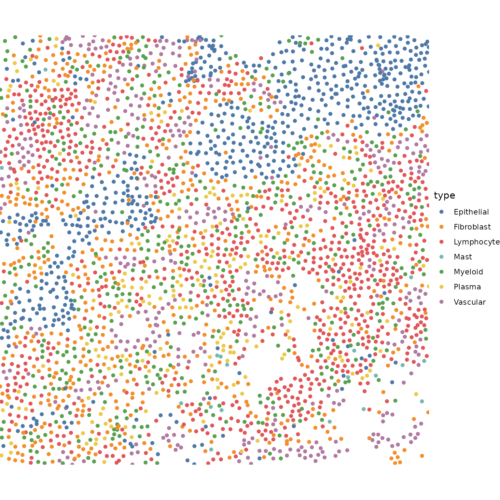

# Walkthrough: Tessera Algorithm Step-by-Step

## Overview

This notebook is a walkthrough of the steps of Tessera, for those who
want to get more familiar with the components.

## Libs

``` r
suppressPackageStartupMessages({
    library(tessera)

    ## Plotting functions 
    ## Not imported by Tessera
    library(ggplot2)
    library(ggthemes)
    library(viridis)
    library(patchwork)
})

fig.size <- function(h, w) {
    options(repr.plot.height = h, repr.plot.width = w)
}
```

## Parameters

``` r
verbose = TRUE
show_plots = TRUE

###### STEP 0 ######
npcs = 10
## Graph pruning
prune_thresh_quantile = 0.95
prune_min_cells = 10


###### STEP 1: GRADIENTS ######
smooth_distance = c('none', 'euclidean', 'projected', 'constant')[3] 
smooth_similarity = c('none', 'euclidean', 'projected', 'constant')[3] 


###### STEP 2: DMT ######
## ... no options


###### STEP 3: AGGREGATION ######
max_npts = 50
min_npts = 5
alpha = 1 ## 0.2 = conservative merging, 2 = liberal merging 
```

## Data

Small sample MERFISH dataset from Chen et al:

<https://www.biorxiv.org/content/10.1101/2023.04.04.535379v1.abstract>

``` r
data('tessera_warmup')
counts = tessera_warmup$counts
meta_data = tessera_warmup$meta_data
meta_vars_include = c('type')
```

``` r
fig.size(8, 8)
ggplot() + 
    geom_point(data = meta_data, aes(X, Y, color = type)) + 
    theme_void() + 
    scale_color_tableau() + 
    coord_sf(expand = FALSE) + 
    NULL
```



Some coarse and fine grained cell types are predefined here, to help
interpret the tiles we get below.

``` r
table(meta_data$type)
#> 
#> Epithelial Fibroblast Lymphocyte       Mast    Myeloid     Plasma   Vascular 
#>        634        588        829         18        491        206        411
```

### prepare

``` r
dmt = init_data(meta_data$X, meta_data$Y, counts, meta_data, meta_vars_include)
dmt = prune_graph(dmt, thresh_quantile = prune_thresh_quantile, mincells = prune_min_cells) 
```

``` r
dmt = add_exterior_triangles(dmt)
```

``` r
fig.size(15, 15)
# fig.size(20, 20)

if (show_plots) {    
    ggplot() + 
    
        # ## big data 
        # geom_point(data = dmt$pts, aes(X, Y), shape = '.', alpha = .1) + 
        # geom_segment(data = dmt$edges[boundary == TRUE], aes(x = x0_pt, y = y0_pt, xend = x1_pt, yend = y1_pt), color = 'red', lwd = .2) + 
    
        ## small data 
        geom_segment(data = dmt$edges, aes(x = x0_pt, y = y0_pt, xend = x1_pt, yend = y1_pt), color = 'black', lwd = .2) + 
        geom_segment(data = dmt$edges[boundary == TRUE], aes(x = x0_pt, y = y0_pt, xend = x1_pt, yend = y1_pt), color = 'red', lwd = .2) + 
        geom_point(data = dmt$pts, aes(X, Y), size = .5) + 
    
        theme_void(base_size = 20) + 
        coord_cartesian(expand = FALSE) + 
        labs(title = 'Pruned adjacency graph') + 
        NULL
}
```


### pca

``` r
dmt$udv_cells = do_pca(dmt$counts, npcs)
```

## Step 1: compute gradients on all data structures

``` r
field = compute_gradients(dmt, smooth_distance, smooth_similarity)
field = compress_gradients_svd(field)
```

``` r
if (show_plots) {    

    len_plot_constant = .8
    fig.size(15, 15)
    # fig.size(20, 20)
    ggplot() + 
        geom_point(data = dmt$pts, aes(X, Y), size = .5) + 
        geom_segment(data = dmt$edges[boundary == TRUE, ], aes(x = x0_pt, y = y0_pt, xend = x1_pt, yend = y1_pt), color = 'red') + 
    
        ## Triangle Gradients
        geom_segment(
            data = data.table(dmt$tris, field$tris_svd), 
            aes(
                x=X-len_plot_constant*(len_grad+len_ortho)*dx_ortho, 
                y=Y-len_plot_constant*(len_grad+len_ortho)*dy_ortho, 
                xend=X+len_plot_constant*(len_grad+len_ortho)*dx_ortho, 
                yend=Y+len_plot_constant*(len_grad+len_ortho)*dy_ortho
            ), 
            linewidth = .4, alpha = 1, 
            color = 'blue'
        ) + 
    
        theme_void() + 
        coord_fixed(expand = FALSE) + 
        NULL
}
```


## Step 2: DMT

### compute f

``` r
dmt = dmt_set_f(dmt, field)
```

``` r
if (show_plots) {    
    ntri = max(which(dmt$tris$external == FALSE))
    i = Matrix::t(dmt$tri_to_pt[1:ntri, ])@i+1
    plt_df = data.table(
        X = dmt$pts$X[i],
        Y = dmt$pts$Y[i],
        f = rep(dmt$tris$f[1:ntri], each = 3)
    )[
        , id := rep(1:ntri, each = 3)
    ][]
    
    
    fig.size(15, 15)
    ggplot() + 
        geom_polygon(data = plt_df, aes(X, Y, group = id, fill = f, color = f)) + 
        theme_void() + 
        coord_fixed(expand = FALSE) + 
        scale_fill_viridis() + 
        scale_color_viridis() + 
        NULL
}
```


### forests

``` r
dmt$prim = do_primary_forest(dmt)
dmt$dual = do_dual_forest(dmt)
```

``` r
if (show_plots) {    
    fig.size(15, 15)
    ggplot() +     
        ## primary forest
        geom_point(data = dmt$tris[dmt$dual$maxima, ], aes(X, Y), color = 'blue', size = 2) + 
        geom_segment(data = dmt$dual$edges, aes(x=x0, y=y0, xend=x1, yend=y1), color = 'blue') + 

        ## primary forest
        geom_point(data = dmt$pts[dmt$prim$minima, ], aes(X, Y), color = 'red', size = 2) + 
        geom_segment(data = dmt$prim$edges, aes(x=x0, y=y0, xend=x1, yend=y1), color = 'red') + 
    
        theme_void() + 
        coord_cartesian(expand = FALSE) + 
        NULL
}
```


### extract epaths

``` r
dmt$e_sep = dmt_get_separatrices(dmt)
```

After DMT, we have a separatrix (in blue) and the primary forest
connecting points (in red).

``` r
if (show_plots) {    
    fig.size(15, 15)
    ggplot() + 
    
        geom_segment(data = dmt$edges[dmt$e_sep, ], aes(x = x0_tri, y = y0_tri, xend = x1_tri, yend = y1_tri), lwd = 1, color = 'blue') + 
        geom_segment(data = dmt$edges[boundary == TRUE], aes(x = x0_pt, y = y0_pt, xend = x1_pt, yend = y1_pt), color = 'blue', lwd = 1) + 
    
        ## primary forest
        geom_point(data = dmt$pts[dmt$prim$minima, ], aes(X, Y), color = 'red', size = 2) + 
        geom_segment(data = dmt$prim$edges, aes(x=x0, y=y0, xend=x1, yend=y1), color = 'red') + 
    
        theme_void() + 
        coord_cartesian(expand = FALSE) + 
        NULL
}
```


### extract tiles

``` r
dmt = dmt_assign_tiles(dmt)
aggs = dmt_init_tiles(dmt)
```

``` r
if (show_plots) {    
    set.seed(2)
    fig.size(15, 20)
    ggplot() + 
        geom_sf(data = aggs$meta_data$shape) + 
        # geom_point(data = dmt$pts, aes(X, Y, color = factor(agg_id, sample(nrow(aggs$meta_data)))), size = 1) + 
        # scale_color_tableau() + 
        theme_void() + 
        coord_sf(expand = FALSE) + 
        # coord_cartesian(expand = FALSE) + 
        guides(color = 'none') + 
        
        NULL 
}
```


``` r
if (show_plots) {    
    set.seed(2)
    fig.size(15, 20)
    ggplot() + 
        geom_sf(data = aggs$meta_data$shape) + 
        geom_point(data = dmt$pts, aes(X, Y, color = type)) + 
        theme_void() + 
        coord_sf(expand = FALSE) + 
        scale_color_tableau() + 
        guides(color = 'none') + 
        NULL 
}
```


## Step 3: Aggregation

### Merge main

First, merge similar aggregates that are nearby.

``` r
aggs = init_scores(aggs, agg_mode=2, alpha=alpha, max_npts=max_npts)
aggs = merge_aggs(aggs, agg_mode=2, max_npts=max_npts)
dmt = update_dmt_aggid(dmt, aggs)
aggs = update_agg_shapes(dmt, aggs)
```

### Merge small outliers

Then go ahead and merge small clusters that are smaller than

``` r
aggs = init_scores(aggs, agg_mode=3, alpha=alpha, min_npts=min_npts)
aggs = merge_aggs(aggs, agg_mode=3, min_npts=min_npts)
dmt = update_dmt_aggid(dmt, aggs)
aggs = update_agg_shapes(dmt, aggs)
```

### Final tiles

``` r
fig.size(10, 30)
if (show_plots) { 
    purrr::map(1:3, function(i) {
        ggplot(cbind(aggs$meta_data, val=aggs$pcs[, i])) + 
            geom_sf(aes(geometry = shape, fill = val)) + 
            theme_void(base_size = 16) + 
            coord_sf(expand = FALSE) + 
            scale_fill_gradient2_tableau() + 
            guides(color = 'none') + 
            labs(title = paste0('PC', i)) + 
            NULL 
    }) %>% 
        purrr::reduce(`|`)
}
```


## Results

### Aggregates

The primary output is the tiles. Each tile has a row in the meta_data
table:

- npts denotes the number of cells in the tile.

``` r
head(aggs$meta_data)
#>       id        X        Y  npts                          shape      area
#>    <int>    <num>    <num> <num>                 <sfc_GEOMETRY>     <num>
#> 1:     1 5578.221 10074.77    39 POLYGON ((5598.428 10051.98... 2624.2586
#> 2:     2 5523.750 10051.83    43 POLYGON ((5513.932 10008.66... 2718.7684
#> 3:     3 5550.940 10103.57    36 POLYGON ((5572.969 10116.07... 2405.4418
#> 4:     4 5577.735 10114.87     8 POLYGON ((5572.969 10116.07...  651.2121
#> 5:     5 5565.044 10019.62    41 POLYGON ((5614.379 10006.3,... 2292.7048
#> 6:     6 5609.770 10088.19    14 POLYGON ((5631.174 10097.96...  998.8177
#>    perimeter
#>        <num>
#> 1:  428.9675
#> 2:  305.5045
#> 3:  281.2410
#> 4:  139.6050
#> 5:  317.2784
#> 6:  189.5318
```

We also have pooled gene counts, for differential gene expression
analysis.

``` r
aggs$counts[1:5, 1:5]
#> 5 x 5 sparse Matrix of class "dgCMatrix"
#>       1 2 3 4 5
#> ACE   1 2 2 1 1
#> ACKR1 . . 1 . .
#> ACKR2 1 . . . .
#> ACKR3 . . 1 . 1
#> ACKR4 . 2 . . .
```

And we have PCA embeddings for the tiles.

``` r
head(aggs$pcs)
#>            PC1        PC2         PC3        PC4       PC5         PC6
#> [1,] 0.6254406  1.0283725  0.83291401 -1.8056105 0.7110007 -0.03214636
#> [2,] 0.5616029 -0.2555397  0.42623300 -1.0095698 0.5037828  0.40149483
#> [3,] 1.2233199 -0.4752796  1.14695964 -0.6278043 0.8871260 -0.06488547
#> [4,] 1.3895474 -1.5392132  4.44642532  1.3297266 1.2699776 -0.95557892
#> [5,] 1.5045535  0.5159752  1.64675922 -0.7636852 0.5256705 -0.32880955
#> [6,] 0.2784406  3.2868679 -0.09497244  1.6126753 0.8367197  0.04392108
#>             PC7         PC8        PC9        PC10
#> [1,] -0.5800751 -0.63061009 -0.3744196 -0.09222084
#> [2,] -1.2530492 -0.02118518  0.4606577  0.83385141
#> [3,] -0.9724555 -0.63276613 -0.1425679  0.22528892
#> [4,] -0.3429736 -0.14724817  1.1103697  0.34060965
#> [5,]  0.2752555 -0.43487561  0.2355197  0.28518495
#> [6,] -1.0273620  0.06585632 -0.4865450  0.10742521
```

The rest of the fields are internal to the algorithm and can be ignored.

``` r
setdiff(names(aggs), c('pcs', 'meta_data', 'counts'))
#> [1] "edges"      "pcs_merged" "d_mu"       "d_sig"      "aggmap"
```

### Points

We also keep information about the cells in `dmt`. Most of the fields
are duplicates of the inputs and some intermediate results.

``` r
names(dmt)
#> [1] "pts"       "tris"      "edges"     "tri_to_pt" "counts"    "udv_cells"
#> [7] "prim"      "dual"      "e_sep"
```

The important fields to keep for further analyses are:

- ORIG_ID: the index of the cell in the input data. Some cells get
  filtered out as outliers, so not all input cells get assigned to an
  aggregate.
- agg_id: the index of the tile in the `aggs` data structures above.

``` r
head(dmt$pts[, .(ORIG_ID, agg_id)])
#>    ORIG_ID agg_id
#>      <int>  <int>
#> 1:       1      1
#> 2:       2      2
#> 3:       3      3
#> 4:       4      4
#> 5:       5      5
#> 6:       6      5
```

## Session Info

``` r
sessionInfo()
#> R version 4.5.2 (2025-10-31)
#> Platform: x86_64-pc-linux-gnu
#> Running under: Ubuntu 24.04.3 LTS
#> 
#> Matrix products: default
#> BLAS:   /usr/lib/x86_64-linux-gnu/openblas-pthread/libblas.so.3 
#> LAPACK: /usr/lib/x86_64-linux-gnu/openblas-pthread/libopenblasp-r0.3.26.so;  LAPACK version 3.12.0
#> 
#> locale:
#>  [1] LC_CTYPE=C.UTF-8       LC_NUMERIC=C           LC_TIME=C.UTF-8       
#>  [4] LC_COLLATE=C.UTF-8     LC_MONETARY=C.UTF-8    LC_MESSAGES=C.UTF-8   
#>  [7] LC_PAPER=C.UTF-8       LC_NAME=C              LC_ADDRESS=C          
#> [10] LC_TELEPHONE=C         LC_MEASUREMENT=C.UTF-8 LC_IDENTIFICATION=C   
#> 
#> time zone: UTC
#> tzcode source: system (glibc)
#> 
#> attached base packages:
#> [1] stats     graphics  grDevices utils     datasets  methods   base     
#> 
#> other attached packages:
#> [1] patchwork_1.3.2   viridis_0.6.5     viridisLite_0.4.2 ggthemes_5.2.0   
#> [5] ggplot2_4.0.1     tessera_0.1.9     Rcpp_1.1.0        data.table_1.17.8
#> 
#> loaded via a namespace (and not attached):
#>  [1] gtable_0.3.6       xfun_0.55          bslib_0.9.0        htmlwidgets_1.6.4 
#>  [5] lattice_0.22-7     vctrs_0.6.5        tools_4.5.2        generics_0.1.4    
#>  [9] parallel_4.5.2     tibble_3.3.0       proxy_0.4-28       pkgconfig_2.0.3   
#> [13] Matrix_1.7-4       KernSmooth_2.23-26 RColorBrewer_1.1-3 S7_0.2.1          
#> [17] desc_1.4.3         lifecycle_1.0.4    compiler_4.5.2     farver_2.1.2      
#> [21] stringr_1.6.0      textshaping_1.0.4  codetools_0.2-20   htmltools_0.5.9   
#> [25] class_7.3-23       sass_0.4.10        yaml_2.3.12        pkgdown_2.2.0     
#> [29] pillar_1.11.1      furrr_0.3.1        jquerylib_0.1.4    classInt_0.4-11   
#> [33] cachem_1.1.0       abind_1.4-8        mclust_6.1.2       RSpectra_0.16-2   
#> [37] parallelly_1.46.0  tidyselect_1.2.1   digest_0.6.39      stringi_1.8.7     
#> [41] future_1.68.0      sf_1.0-23          dplyr_1.1.4        purrr_1.2.0       
#> [45] listenv_0.10.0     labeling_0.4.3     magic_1.6-1        fastmap_1.2.0     
#> [49] grid_4.5.2         cli_3.6.5          magrittr_2.0.4     e1071_1.7-17      
#> [53] withr_3.0.2        scales_1.4.0       rmarkdown_2.30     globals_0.18.0    
#> [57] igraph_2.2.1       otel_0.2.0         gridExtra_2.3      ragg_1.5.0        
#> [61] evaluate_1.0.5     knitr_1.51         geometry_0.5.2     rlang_1.1.6       
#> [65] glue_1.8.0         DBI_1.2.3          jsonlite_2.0.0     R6_2.6.1          
#> [69] systemfonts_1.3.1  fs_1.6.6           units_1.0-0
```
